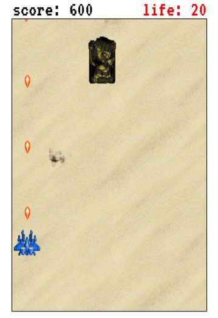

# Canvas Force 2016

### [Live link!](http://rowidont.github.io/canvas-force-2016/)

#### What's it all about?

The simple answer is that it's all about destroying an army of tanks in your super high tech ship. The longer answer is pretty much the same.

#### Screenshots?

Sure. Check out this screenshot from a 0.5 second lull in the fighting:

#### But how does it all work?!

Great question! At its core, this game runs on javascript. All the amazing 21st century animations are happening in Canvas, an API introduced to the scene in 2004. Canvas is really all about its name. Every frame the user sees on the page is an actual image drawn by the Canvas API.

#### Future goals

- Add ancient ruins that the player must dodge.
- Increase difficulty as the score increases (more enemies!)
- Add a splash screen BEFORE the game starts.
